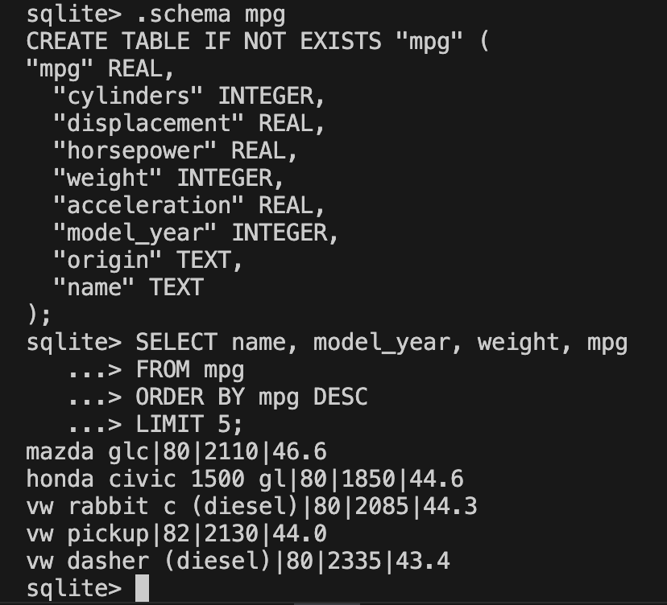

# SQL Learning Sandbox


A learning environment for practicing SQLite queries with example and fictional data. This project provides a structured way to learn SQL concepts through practical exercises using a pre-populated SQLite database.

## Overview

This project helps learners practice SQL with:
- A pre-configured SQLite database with fictional data
- Structured lessons and exercises
- Easy database resets for experimentation
- Real-world-like scenarios + practical examples

## Getting Started


### Prerequisites
- Python 3.7 or higher (Anaconda's Distribution Recommended)
- SQLite 3.x (Included With Python)
- Git + Beginner or Basic Git Knowledge
- Beginner or Basic Python knowledge
- Basic command line knowledge
- Basic understanding of SQL queries

### Installation

1. Clone this repository:
```bash
git clone https://github.com/adamrossnelson/sql-sandbox.git
```
This command creates a local copy of the repository on your computer.

2. In the project folder (`cd sql-sandbox`), set up the learning environment:
```bash
python build-sandbox.py
```
This will create and populate the SQLite database with fictional data.   
**Note**: The `mpg` dataset comes from the `seaborn` library in pyhton. If you encounter an error related to this, install the library by running:  
```bash
pip install seaborn
```

## Usage

### Database Reset
If you want to start fresh or reset your database to its original state:
```bash
python reset-sandbox.py
```
**Note**: You do not need to run this if you're using the sandbox for the first time.

### Quick Start Example
After setting up your environment, you can start exploring the data:

1. Open SQLite command line interface:
```bash
sqlite3 sandbox.db
```  
**Note**: If the terminal does not respond after running the command,   
try checking whether SQLite is properly installed by running:  
```bash
sqlite3 --version
```
If you still experience issues, try restarting your terminal or computer.

2. Once in SQLite, you can see available tables:
```sql
.tables
```
Databases consist of tables, and this shows a list of all available tables in this database.

3. View the structure of the mpg table:
```sql
.schema mpg
```

4. Find the five most fuel efficient vehicles:
```sql
SELECT name, model_year, weight, mpg
FROM mpg
ORDER BY mpg DESC
LIMIT 5;
```
If everything is going right, you would see the following result in your terminal.  


5. Return to system cli / terminal:
```sql
.quit
```

## Database Schema

The sandbox database includes the following tables from Seaborn's example datasets:

### Cars (mpg dataset)
A dataset of car fuel efficiency from 1999 to 2008, including:
- manufacturer, model, year
- engine displacement, cylinders
- city and highway MPG ratings
- vehicle class

### Tips Dataset
Restaurant tipping behavior data including:
- bill total and tip amount
- day of week, time of day
- party size
- server gender

### Penguins Dataset
Measurements of Antarctic penguins including:
- species (Adelie, Gentoo, Chinstrap)
- bill length and depth
- flipper length
- body mass
- island location

## Contributing

Contributions are welcome! Please feel free to submit a Pull Request.

## To Do Items

### Core Features
- [ ] Create a way to specify the database name
- [ ] Add a small set of realistic relational tables with fictional data (e.g., bookstore, library, or school system)
- [ ] Add command line arguments support for both scripts (e.g., --quiet, --force)
- [ ] Add option to backup existing database before modifications

### Learning Resources
- [ ] Add example queries for common SQL operations
- [ ] Create a series of progressive SQL exercises
- [ ] Create troubleshooting guide for common SQL errors

### Testing
- [ ] Add unit/integration tests

## License

This project is licensed under the MIT License - see the LICENSE file for details.
